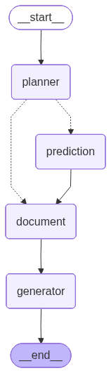

# Customer Agentic RAG – Smart Retail Intelligence

A **full Agentic RAG (Retrieval-Augmented Generation) system** for customer behavior analysis and explainable retail intelligence.

This project combines:
- **Markov-based next-item prediction**
- **PDF-based RAG using Vector Databases**
- **LLM-powered explanations (Gemma via Ollama)**
- **Agentic planning with LangGraph**
- **Interactive Streamlit dashboard**

---

##  Key Features

-  Predict what a customer will buy next using a **Markov Chain model**
-  Explain predictions using a **local LLM (Gemma 3:1B via Ollama)**
-  Upload PDFs (sales reports, policies) and query them via **RAG + Vector DB**
-  Intelligent **Agentic RAG Planner** using **LangGraph**
-  Beautiful, user-friendly **Streamlit dashboard**
-  Modular, extensible architecture (agents, tools, planner)

---

##  System Architecture (High-Level)

```
User (Dashboard)
   ↓
LangGraph Planner Agent
   ↓ decides tools
┌──────────────────────────────┐
│  Prediction Tool (Markov)    │
│  Document RAG Tool (VectorDB)│
└──────────────────────────────┘
   ↓
Generator Agent (LLM)
   ↓
Final Answer + Explanation
```

---

## 📂 Project Structure

```
customer_agentic_rag/
│
├── dashboard.py                  # Streamlit UI
├── langgraph_app.py              # LangGraph agent definition
├── requirements.txt
│
├── agents/
│   ├── state.py                  # Shared agent state
│   ├── planner_node.py           # Planner agent (tool selection)
│   ├── prediction_node.py        # Markov prediction node
│   ├── document_rag_node.py      # PDF RAG node
│   ├── generator_node.py         # Final answer generator
│
├── models/
│   └── markov_model.py           # Markov next-item prediction
│
├── embeddings/
│   └── vector_store.py           # FAISS-based vector DB
│
├── ingestion/
│   └── ingest_documents.py       # PDF ingestion & chunking
│
├── llm/
│   └── ollama_client.py          # Ollama LLM wrapper
│
├── data/
│   └── update_dataset11.csv      # Customer transaction dataset
│
└── assets/
    └── agent_graph.png           # LangGraph visualization
```

---

##  Dataset Description

**File:** `data/update_dataset11.csv`

Schema:
```
customer_id, transaction_id, timestamp, item_sequence,
item, category, quantity, price, discount,
day_of_week, time_of_day, loyalty_level
```

- Supports **basket-level purchases** (multiple items per transaction)
- Preserves **order within baskets** and **across time**
- Suitable for **sequential modeling (Markov)** and **behavior analysis**

---

## Prediction Model

### Model Used: First-Order Markov Chain

**Definition:**

```
P(next_item | current_item)
```

- Learns transition probabilities between consecutive items
- Simple, interpretable, and widely used as a retail baseline
- Works well for prototypes, demos, and explainable systems

---

## RAG for PDF Documents

### What is stored in Vector DB?

- NOT raw CSV rows
- NOT entire PDFs

**Chunked textual summaries** extracted from PDFs

### RAG Flow

1. Upload PDF from dashboard
2. Extract text → chunk → embed
3. Store embeddings in FAISS vector DB
4. Retrieve relevant chunks for a query
5. LLM generates a grounded explanation

### Planner Decisions

| User Query | Planner Action |
|----------|---------------|
| Next product prediction | PREDICTION |
| Explain PDF | DOCUMENT |
| Why prediction + evidence | PREDICTION + DOCUMENT |

---

## 🖥️ Streamlit Dashboard

### Tabs

1. **Customer Data** – purchase history & profile
2. **Prediction** – next-item probabilities + charts
3. **Agent Explanation** – natural language answers
4. **Agent Graph** – LangGraph visualization

Designed for **non-technical users** (management, examiners, demos).

---

##  Installation & Setup

###  Create virtual environment

```bash
python -m venv .venv
source .venv/bin/activate  # macOS/Linux
```

### Install dependencies

```bash
pip install -r requirements.txt
```

### Install & run Ollama

```bash
ollama pull gemma3:1b
```

### Run the dashboard

```bash
streamlit run dashboard.py
```

---

## Example Query

> "What will this customer buy next and why?"

**Output:**
- Prediction from Markov model
- Explanation from LLM
- Optional PDF-based evidence (if uploaded)

---


## Conclusion

This project demonstrates **modern AI system design**:
- Prediction + RAG + Agents
- Explainability by design
- Clean separation of concerns


---

 Built with care for clarity, learning, and real-world relevance.


---

## 👨‍💻 Author

# **Md Saib Hossain**
**AI Engineer • AI / ML / LLM & AI Safety Researcher**  
**Agentic AI Developer • Researcher in Autonomous & Multi-Agent Systems • Advanced Agentic AI Architect**

Designing safe, scalable, and human-centered intelligent systems for real-world healthcare and autonomous AI applications.

<p align="left">
  <a href="mailto:saibhossain5@gmail.com">
    
  </a>
  
  <a href="https://saibhossain.github.io/">
    
  </a>
  <a href="https://github.com/Saibhossain">
    
  </a>
  <a href="https://linkedin.com/in/saib-hossain-182834229">
    
  </a>
</p>

> Prototype project on Agentic RAG for Customer Behavior Analysis